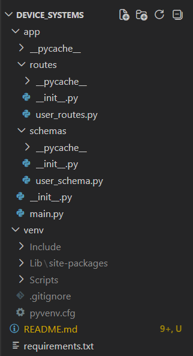
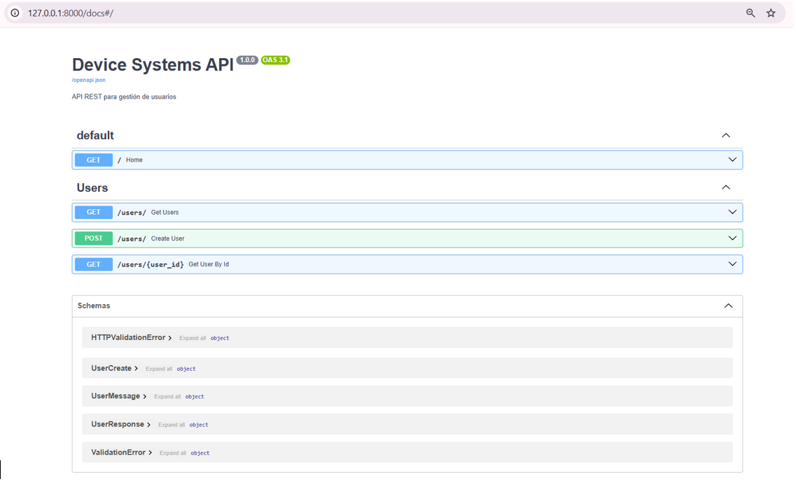
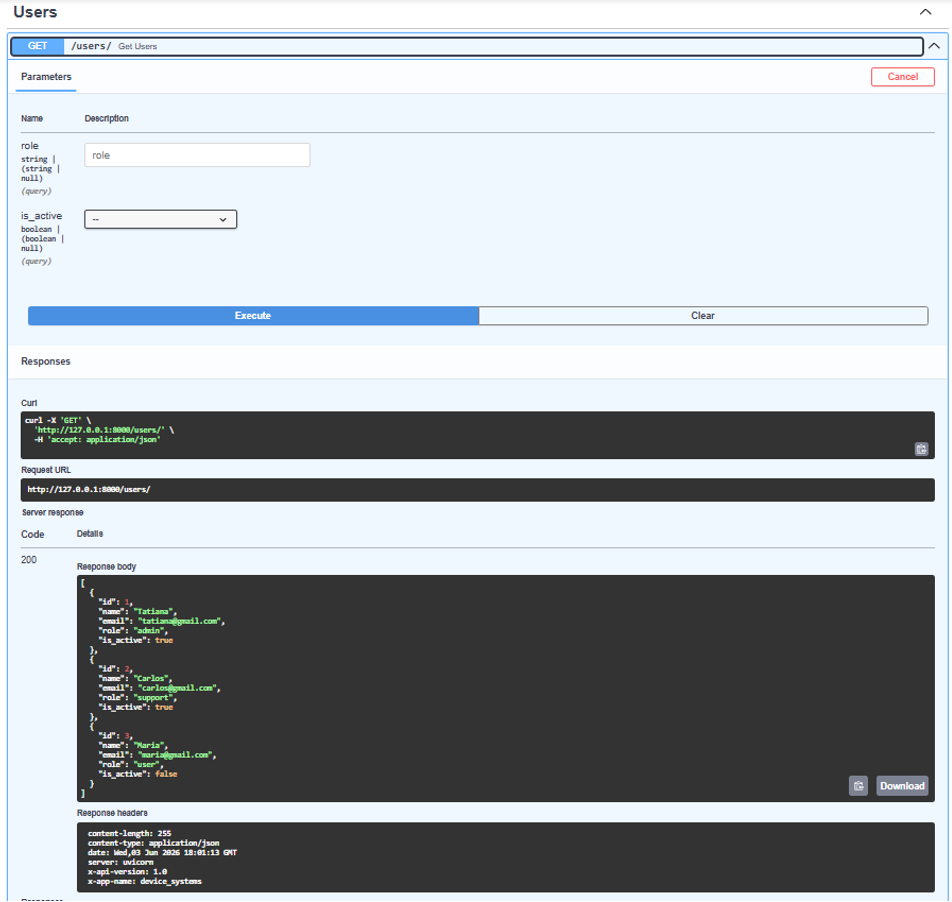
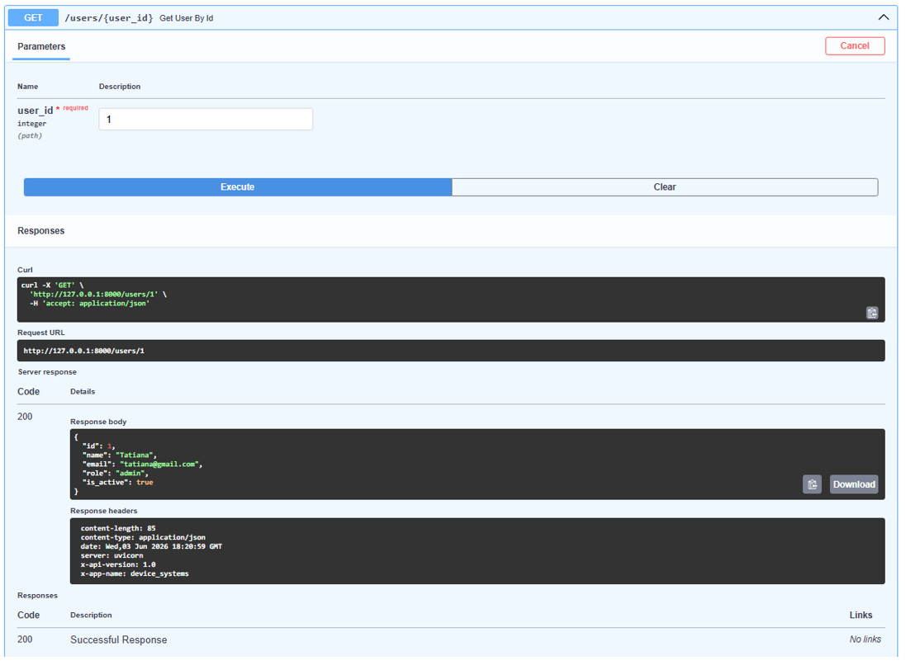
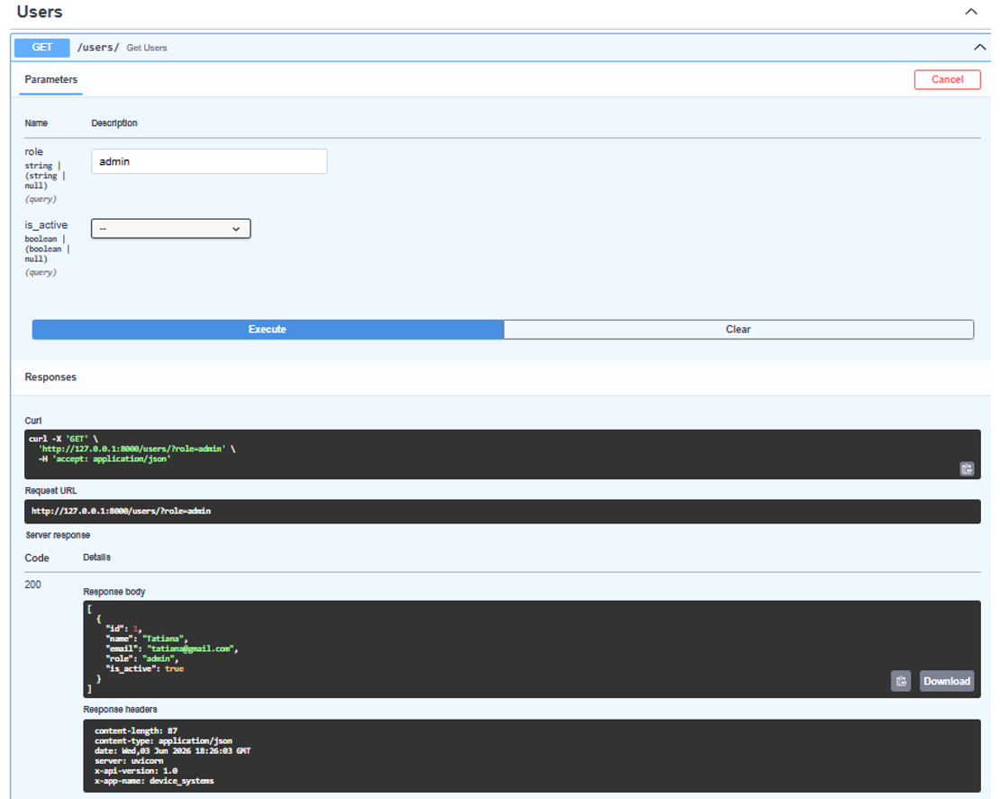
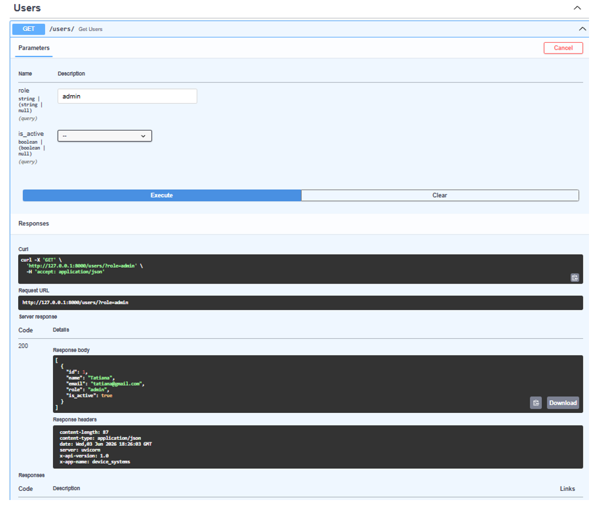
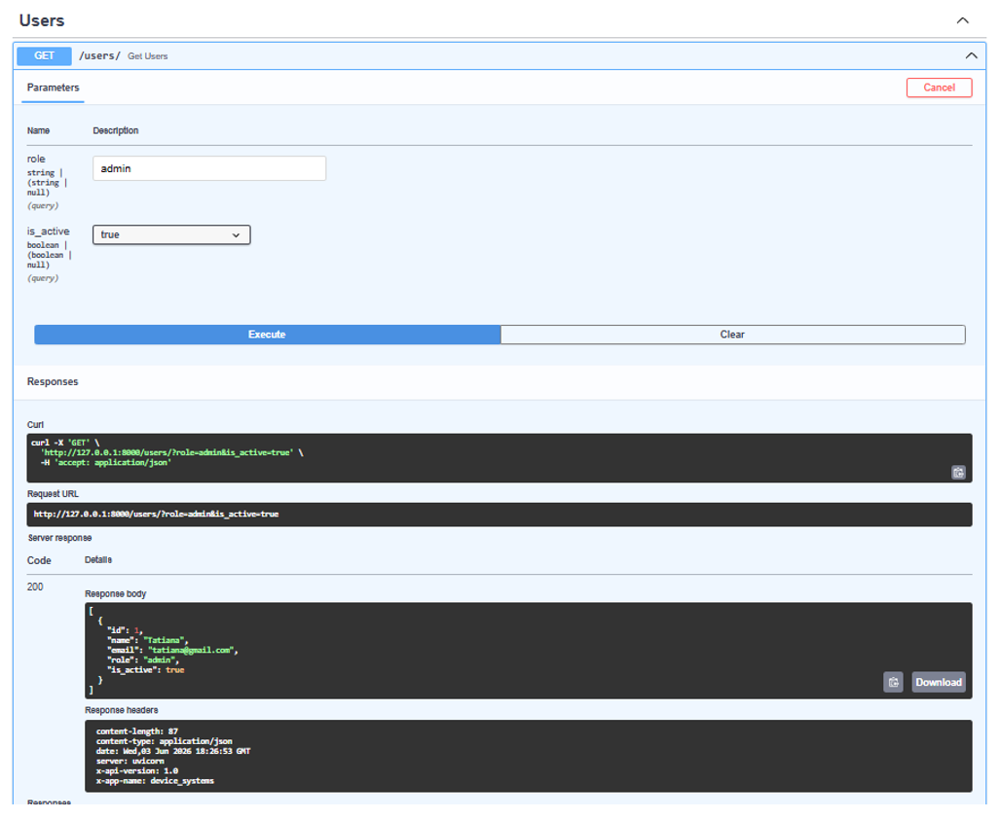
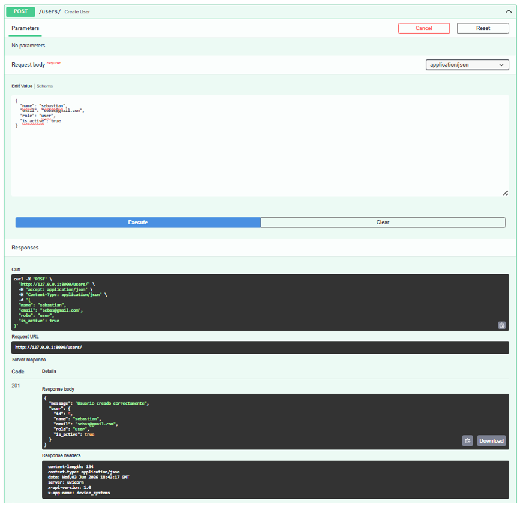
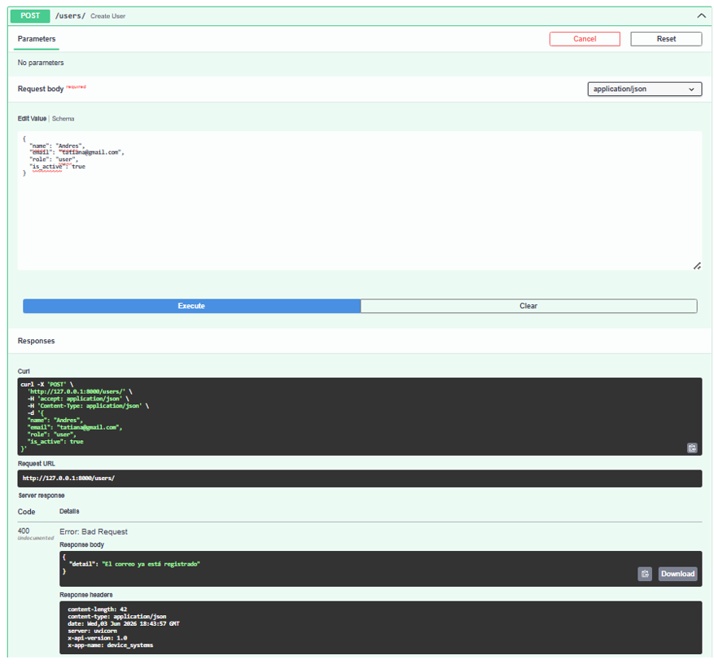
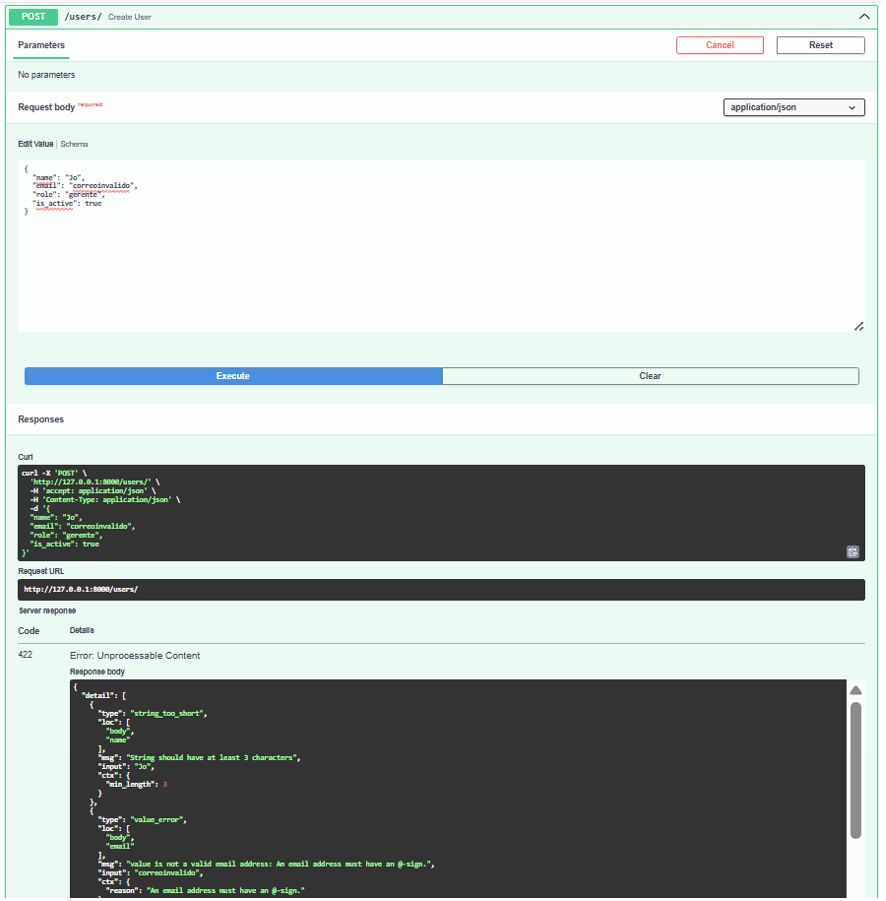

# Device Systems API

## Descripción

**Device Systems API** es una aplicación backend desarrollada con **FastAPI** para la gestión de usuarios mediante una API REST.

La aplicación permite:

- Listar usuarios.
- Consultar usuarios por ID.
- Filtrar usuarios por rol.
- Filtrar usuarios por estado activo/inactivo.
- Registrar nuevos usuarios.
- Validar datos utilizando Pydantic v2.
- Evitar correos electrónicos duplicados.
- Implementar Response Models.
- Agregar cabeceras HTTP personalizadas.

---

## Tecnologías utilizadas

- Python 3.x
- FastAPI
- Uvicorn
- Pydantic v2
- Swagger UI

---

## Estructura del proyecto

```text
device_systems/
│
├── app/
│   │
│   ├── __init__.py
│   ├── main.py
│   │
│   ├── routes/
│   │   ├── __init__.py
│   │   └── user_routes.py
│   │
│   └── schemas/
│       ├── __init__.py
│       └── user_schema.py
│
├── requirements.txt
│
└── README.md
```

## Instalación

### 1. Clonar el repositorio

```bash
git clone https://github.com/TU-USUARIO/device_systems.git
cd device_systems
```

### 2. Crear entorno virtual

```bash
python -m venv venv
```

### 3. Activar entorno virtual

**Windows**

```bash
.\venv\Scripts\activate
```

**Linux / Mac**

```bash
source venv/bin/activate
```

### 4. Instalar dependencias

```bash
pip install -r requirements.txt
```

---

## Ejecución del servidor

Ejecutar:

```bash
uvicorn app.main:app --reload
```

Salida esperada:

```text
INFO: Uvicorn running on http://127.0.0.1:8000
```

---

## Documentación automática

### Swagger UI

```text
http://127.0.0.1:8000/docs
```

### ReDoc

```text
http://127.0.0.1:8000/redoc
```

---

## Endpoints disponibles

| Método | Endpoint | Descripción |
|---------|----------|-------------|
| GET | / | Mensaje de bienvenida |
| GET | /users | Obtener todos los usuarios |
| GET | /users/{user_id} | Obtener usuario por ID |
| GET | /users?role=admin | Filtrar usuarios por rol |
| GET | /users?is_active=true | Filtrar usuarios activos |
| POST | /users | Crear nuevo usuario |

---

# Modelos de Datos

## UserCreate

Modelo utilizado para crear usuarios.

### Campos

| Campo | Tipo | Validación |
|---------|------|-----------|
| name | string | mínimo 3 caracteres |
| email | EmailStr | correo válido |
| role | string | admin, support o user |
| is_active | boolean | true o false |

---

## UserResponse

Modelo utilizado para responder información de usuarios.

```json
{
  "id": 1,
  "name": "Tatiana",
  "email": "tatiana@gmail.com",
  "role": "admin",
  "is_active": true
}
```

---

# Ejemplos de Peticiones

## GET /users

### Petición

```http
GET /users
```

### Respuesta

```json
[
  {
    "id": 1,
    "name": "Tatiana",
    "email": "tatiana@gmail.com",
    "role": "admin",
    "is_active": true
  },
  {
    "id": 2,
    "name": "Carlos",
    "email": "carlos@gmail.com",
    "role": "support",
    "is_active": true
  },
  {
    "id": 3,
    "name": "Maria",
    "email": "maria@gmail.com",
    "role": "user",
    "is_active": false
  }
]
```

---

## GET /users/{user_id}

### Petición

```http
GET /users/1
```

### Respuesta

```json
{
  "id": 1,
  "name": "Tatiana",
  "email": "tatiana@gmail.com",
  "role": "admin",
  "is_active": true
}
```

---

## GET /users?role=admin

### Petición

```http
GET /users?role=admin
```

### Respuesta

```json
[
  {
    "id": 1,
    "name": "Tatiana",
    "email": "tatiana@gmail.com",
    "role": "admin",
    "is_active": true
  }
]
```

---

## GET /users?is_active=true

### Petición

```http
GET /users?is_active=true
```

### Respuesta

```json
[
  {
    "id": 1,
    "name": "Tatiana",
    "email": "tatiana@gmail.com",
    "role": "admin",
    "is_active": true
  },
  {
    "id": 2,
    "name": "Carlos",
    "email": "carlos@gmail.com",
    "role": "support",
    "is_active": true
  }
]
```

---

## POST /users

### Petición

```json
{
  "name": "Andres",
  "email": "andres@gmail.com",
  "role": "user",
  "is_active": true
}
```

### Respuesta

```json
{
  "message": "Usuario creado correctamente",
  "user": {
    "id": 4,
    "name": "Andres",
    "email": "andres@gmail.com",
    "role": "user",
    "is_active": true
  }
}
```

---

# Validaciones Implementadas

## Nombre

Debe contener mínimo 3 caracteres.

### Ejemplo inválido

```json
{
  "name": "Jo"
}
```

---

## Correo electrónico

Debe tener formato válido.

### Ejemplo inválido

```json
{
  "email": "correo_invalido"
}
```

---

## Rol

Valores permitidos:

- admin
- support
- user

### Ejemplo inválido

```json
{
  "role": "manager"
}
```

---

## Correo duplicado

Si un correo ya existe en el sistema:

```json
{
  "detail": "El correo ya está registrado"
}
```

---

# Cabeceras HTTP Personalizadas

La API agrega automáticamente las siguientes cabeceras:

```http
X-App-Name: device_systems
X-API-Version: 1.0
```

# Evidencias

## captura 1



## captura 2



## captura 3



## captura 4



## captura 5



## captura 6



## captura 7



## captura 8



## captura 9



## captura 10



# Reflexión FinaL

Durante el desarrollo de esta actividad aprendi el funcionamiento de FastAPI para construir APIs REST de forma rápida y organizada.

Se implementaron endpoints GET y POST, utilizando Path Parameters y Query Parameters para realizar consultas dinámicas. Además, se aplicaron validaciones mediante Pydantic v2, garantizando la integridad de los datos recibidos por la API.

También se comprendió la importancia de los Response Models para estandarizar las respuestas y de las cabeceras HTTP para proporcionar información adicional a los clientes que consumen el servicio.

Swagger UI facilitó la documentación y las pruebas de cada endpoint, permitiendo validar el correcto funcionamiento de la aplicación.

FastAPI demostró ser una herramienta moderna, eficiente y fácil de usar para el desarrollo de APIs REST en Python.

------------------------------------------

